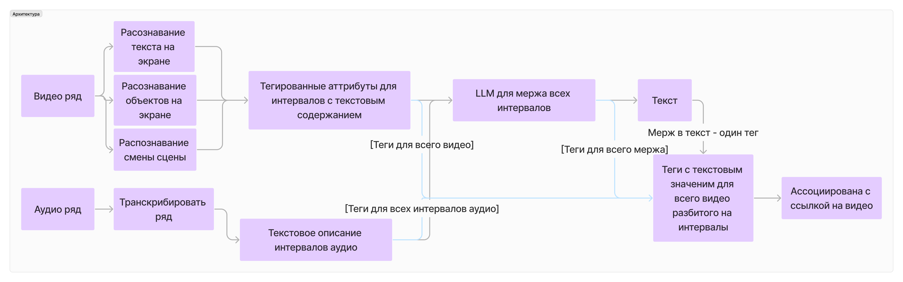

# Yappy backend

1) Обработка нового видео. 
Обогащение его дополнительными признаками с помощью специальных алгоритмов, моделей машинного обучения. Добавление этой информации в индекс - хранилище.
2) Непосредственно поиск. 
Выдача наиболее релевантного контента на текстовый запрос от пользователя. При этом надо учитывать, что пользователь может вводить несколько букв, слова, словосочетания, предложения, любые комбинации символов. Предоставленные для решения задачи данные состоят из видеофайла формата mp4 и описания видео в текстовом формате. Система поиска может учитывать разные сущности, такие как: описание пользователя под видео, речь в самом видео, текст в самом видео, описание видео, полученное какой-либо системой или нейронной сетью. Генерация таких признаков может осуществляться с помощью любых open-source или самописных решений/инструментов



## Структура Базы Данных для коллекции "videos"

| Поле               | Тип        | Описание                                               |
|--------------------|------------|--------------------------------------------------------|
| id                 | string     | Уникальный идентификатор результатов обработки видео   |
| url                | string     | URL видео                                              |
| description        | string     | Описание видео                                         |
| interval_type      | string     | Тип данных для интервала                               |
| content            | string[]   | Содержимое видео (массив строк)                        |
| start_stop_interval| string[]   | Интервалы начала и окончания в формате "ЧЧ:ММ:СС-ЧЧ:ММ:СС"|
| status             | string     | Состояние обработки видео                              |

## Get started
```
docker compose up
```